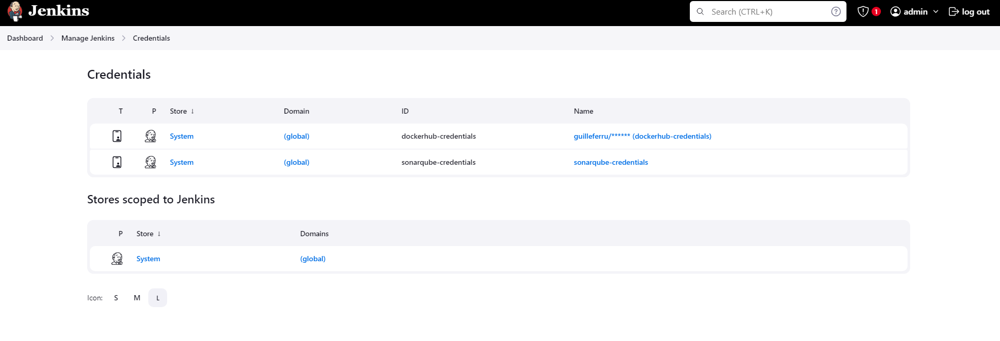

# Aplicación Tipo Microservicio

Este repositorio contiene una aplicación basada en microservicios, con un pipeline automatizado en **Jenkins** que utiliza **Maven** para la construcción, pruebas y verificación de código, **SonarQube** para el análisis de calidad de código, y **Docker** para la creación y publicación de imágenes en DockerHub.

## Descripción General

El pipeline de Jenkins definido en el archivo `Jenkinsfile` sigue un enfoque de integración continua (CI), automatizando la construcción, análisis, verificación y publicación de la aplicación en un entorno Docker.

##  Infraestructura en AWS

Se ha creado una infraestructura automatizada en AWS utilizando **Terraform**. Esta infraestructura incluye una instancia EC2 sobre la cual se desplegaron varios servicios clave mediante **Ansible**:

- **Jenkins**: Para la gestión de pipelines de integración continua.
- **SonarQube**: Para el análisis de calidad de código y la implementación de reglas de control de calidad.

Puedes acceder al repositorio con la configuración de la infraestructura y su código fuente en este [enlace](https://github.com/GuilleFerru/arqDevOps_MT_final_aws.git).

## Estructura del Pipeline

El pipeline se compone de las siguientes etapas:

1. **Validate**:
   - Ejecuta `mvn validate` para comprobar que el proyecto está correctamente configurado.

2. **Compile**:
   - Compila el código fuente utilizando `mvn compile`.

3. **Test**:
   - Ejecuta las pruebas unitarias con `mvn clean test` y genera reportes de pruebas (`JUnit`) y cobertura de código (`Jacoco`).

4. **Verify**:
   - Verifica el proyecto utilizando `mvn verify` para asegurarse de que cumple con los requisitos del build.

5. **Package**:
   - Genera el artefacto empaquetado (`JAR`) usando `mvn package` sin ejecutar las pruebas.

6. **SonarQube**:
   - Analiza la calidad del código utilizando **SonarQube** y reporta los resultados a la rama correspondiente.

   

7. **Quality Gate**:
   - Espera el resultado del **Quality Gate** de SonarQube. Si no se cumplen las condiciones de calidad (como una cobertura de código superior al 60%), el pipeline se aborta.

   

8. **Docker Image**:
   - Construye y publica una imagen Docker en **DockerHub**, utilizando `buildx` para soportar múltiples plataformas (linux/amd64 y linux/arm64).
   - La imagen es etiquetada tanto con la versión del artefacto como con `latest`.

### Configuración de Jenkins

El pipeline utiliza los siguientes plugins de Jenkins:

- **JUnit**: Para la generación de reportes de pruebas.
- **Jacoco**: Para la cobertura de código.
- **SonarQube**: Para el análisis de calidad de código.
- **Docker Pipeline**: Para la construcción y publicación de imágenes Docker.


### Ejecución del Pipeline

Para ejecutar este pipeline, asegúrate de tener configurados los siguientes elementos en Jenkins:

- **Credenciales de DockerHub**: Configura las credenciales con el ID `dockerhub-credentials`.
- **SonarQube**: Configura un servidor SonarQube y asegúrate de que el pipeline esté conectado con el mismo mediante el ID `sonarqube`.



### Publicación de la Imagen Docker

El pipeline crea y publica una imagen Docker en **DockerHub**. La imagen es etiquetada con la versión del artefacto y `latest`:


```bash
docker pull guilleferru/<artifactId>:<version>
docker pull guilleferru/<artifactId>:latest
